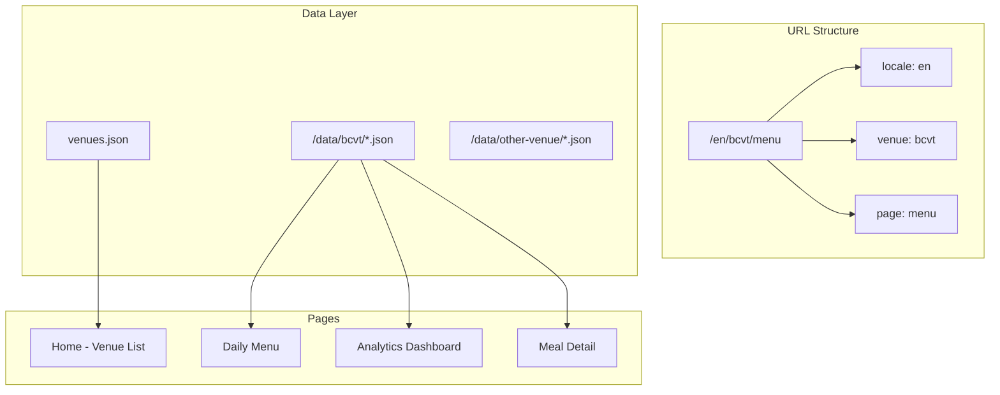
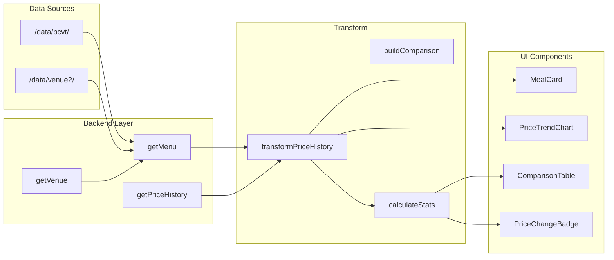

# Multi-Venue Price Analytics Platform

## Current State

The app is a single-venue daily menu browser for BCVT canteen:

- Data fetched from a single `DATA_BASE_URL` endpoint
- No venue identifier in data models
- Basic price history with delta calculations exists in `[src/utils/transformPriceHistory.ts](src/utils/transformPriceHistory.ts)`

## Target Architecture




---

## Phase 1: Multi-Venue Foundation

### 1.1 Venue Configuration

Create a venues configuration file:

```typescript
// src/config/venues.ts
export interface VenueConfig {
  id: string;           // URL slug: "bcvt"
  name: string;         // Display name: "BCVT Canteen"
  dataUrl: string;      // Base URL for venue data
  currency: string;     // Default currency
  locale: string;       // Default locale for menu items
}

export const venues: VenueConfig[] = [
  {
    id: 'bcvt',
    name: 'BCVT Canteen',
    dataUrl: process.env.DATA_BASE_URL || '',
    currency: 'BGN',
    locale: 'bg'
  }
];
```

### 1.2 Update Data Models

Extend types in `[src/types/app.ts](src/types/app.ts)`:

```typescript
export interface VenueMeal extends EnrichedMeal {
  venueId: string;
}

export interface PriceComparison {
  mealName: string;
  venues: Array<{
    venueId: string;
    venueName: string;
    currentPrice: PriceHistoryItem | null;
    priceHistory: PriceHistoryItem[];
  }>;
}
```

### 1.3 Update Routing Structure

Current: `/[locale]/(menu)/page.tsx`

New structure:

```
src/app/[locale]/
├── page.tsx                      # Venue selector (home)
├── [venue]/
│   ├── layout.tsx                # Venue context provider
│   ├── (menu)/
│   │   ├── page.tsx              # Daily menu (existing, adapted)
│   │   └── layout.tsx
│   ├── [mealName]/
│   │   └── page.tsx              # Meal detail (existing, adapted)
│   └── analytics/
│       └── page.tsx              # NEW: Analytics dashboard
```

### 1.4 Update Backend Functions

Modify `[src/backend/getMenu.ts](src/backend/getMenu.ts)` and others to accept `venueId`:

```typescript
export const getMenu = async (venueId: string, date: Date): Promise<EnrichedMeal[]>
export const getPriceHistory = async (venueId: string): Promise<MergedMealItem[]>
```

---

## Phase 2: Analytics Features

### 2.1 Price Trends (Charts)

Create a new component for price trend visualization:

`**src/components/PriceTrendChart.tsx**`

- Line chart showing price over time
- Support for different time ranges (week, month, 3 months, year, all)
- Uses a lightweight charting library (e.g., Recharts or Chart.js)

`**src/components/PriceSparkline.tsx**`

- Mini inline chart for meal cards
- Shows recent price trend at a glance

### 2.2 Price Alerts/Badges

`**src/components/PriceChangeBadge.tsx**`

- Visual indicator for significant price changes
- Thresholds: >5% increase (red), >5% decrease (green), new item, etc.

`**src/components/PriceSurprises.tsx**` (existing)

- Extend to support venue context
- Add filtering by change type (increases, decreases, new items)

### 2.3 Cross-Venue Comparisons

`**src/app/[locale]/compare/page.tsx**`

- Compare same meal across venues
- Table view with venue columns
- Highlight cheapest/most expensive

`**src/components/VenueComparisonTable.tsx**`

- Side-by-side price comparison
- Shows current price and recent trend per venue

### 2.4 Date Range History

`**src/components/DateRangePicker.tsx**`

- Select custom date ranges for analysis

`**src/app/[locale]/[venue]/analytics/page.tsx**`

- Weekly/monthly/custom range statistics
- Average prices, volatility, biggest movers
- Filterable by category

---

## Phase 3: UI/Navigation Updates

### 3.1 Sidebar Updates

Update `[src/components/Sidebar.tsx](src/components/Sidebar.tsx)`:

```typescript
const navItems = [
  { href: `/${venue}`, labelKey: 'dailyMenu', icon: <UtensilsCrossed /> },
  { href: `/${venue}/analytics`, labelKey: 'analytics', icon: <TrendingUp /> },
];
```

Add venue selector component at top of sidebar.

### 3.2 Home Page (Venue List)

`**src/app/[locale]/page.tsx**`

- Grid of venue cards
- Each shows venue name, item count, recent activity

### 3.3 Analytics Dashboard

`**src/app/[locale]/[venue]/analytics/page.tsx**`

- Summary cards: avg price change, biggest increases/decreases
- Price trend chart for selected items
- Category breakdown
- Date range selector

---

## Data Flow




---

## Implementation Order

1. **Phase 1.1-1.2**: Venue config and data model updates
2. **Phase 1.3**: Routing restructure (move existing pages under `[venue]`)
3. **Phase 1.4**: Update backend to be venue-aware
4. **Phase 2.1**: Add charting library and trend components
5. **Phase 2.4**: Analytics dashboard page
6. **Phase 2.2**: Price alert badges
7. **Phase 3.1-3.2**: Sidebar and home page updates
8. **Phase 2.3**: Cross-venue comparison (after multiple venues exist)

---

## Dependencies to Add

```bash
# Charting library (choose one)
yarn add recharts
# or
yarn add lightweight-charts
```

---

## Files to Create/Modify

**New files:**

- `src/config/venues.ts` - Venue configuration
- `src/app/[locale]/page.tsx` - Home/venue selector
- `src/app/[locale]/[venue]/layout.tsx` - Venue context
- `src/app/[locale]/[venue]/analytics/page.tsx` - Analytics dashboard
- `src/components/PriceTrendChart.tsx` - Price chart
- `src/components/PriceSparkline.tsx` - Inline sparkline
- `src/components/PriceChangeBadge.tsx` - Change indicators
- `src/components/DateRangePicker.tsx` - Date range selection
- `src/components/VenueSelector.tsx` - Venue switcher

**Modified files:**

- `src/types/app.ts` - Add venue types
- `src/backend/*.ts` - Add venue parameter
- `src/components/Sidebar.tsx` - Add analytics nav, venue context
- `src/app/[locale]/(menu)/` - Move under `[venue]`
- `src/i18n/locales/*.json` - Add analytics translations

