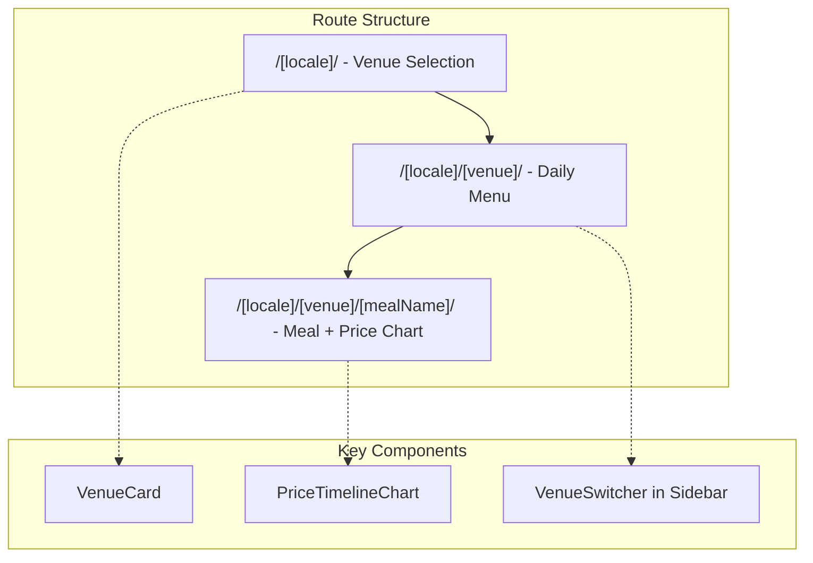

# Multi-Venue Price Analytics UX

## Overview

Transform the single-venue menu browser into a multi-venue price tracking app with:

1. URL-based venue routing (`/[locale]/[venue]/...`)
2. Price timeline chart for individual meals
3. Updated navigation to reflect venue context

## URL Structure

```
Current:
/[locale]/                    → Daily menu
/[locale]/[mealName]/         → Meal details

Proposed:
/[locale]/                    → Venue selection (homepage)
/[locale]/[venue]/            → Daily menu for venue
/[locale]/[venue]/[mealName]/ → Meal details with price chart
/[locale]/[venue]/stats/      → (Future) Venue-wide statistics
```

## Architecture




## Implementation Steps

### Phase 1: Venue Routing Structure

**1. Create venue configuration**

Create `[src/config/venues.ts](src/config/venues.ts)` with venue definitions (mock data for UX):

```typescript
export interface Venue {
  id: string;           // URL slug
  name: string;         // Display name
  description?: string;
  dataUrl?: string;     // Future: per-venue data source
}

export const venues: Venue[] = [
  { id: 'bcvt', name: 'BCVT Cantine', description: 'Company canteen' },
  { id: 'demo-restaurant', name: 'Demo Restaurant', description: 'Sample venue' },
];
```

**2. Restructure route folders**

Move current menu routes under a `[venue]` dynamic segment:

```
src/app/[locale]/
├── page.tsx                    # NEW: Venue selection homepage
├── [venue]/
│   ├── (menu)/
│   │   ├── layout.tsx          # MOVE from current (menu)/
│   │   ├── page.tsx            # MOVE: Daily menu
│   │   ├── loading.tsx
│   │   └── error.tsx
│   └── [mealName]/
│       └── page.tsx            # MOVE: Meal details
├── layout.tsx                  # Keep as-is
```

**3. Create venue selection homepage**

New `[src/app/[locale]/page.tsx](src/app/[locale]/page.tsx)`:

- Grid of venue cards
- Each card links to `/[locale]/[venue]/`
- Clean, modern design using existing Card component

**4. Update sidebar for venue context**

Modify `[src/components/Sidebar.tsx](src/components/Sidebar.tsx)`:

- Show current venue name at top
- Add venue switcher (dropdown or list)
- Update "Daily menu" link to be venue-aware

### Phase 2: Price Timeline Chart

**1. Install charting library**

```bash
npm install recharts
```

Recharts is React-native, lightweight, and works well with Next.js.

**2. Create PriceTimelineChart component**

Create `[src/components/PriceTimelineChart.tsx](src/components/PriceTimelineChart.tsx)`:

- Line/area chart showing price over time
- X-axis: dates
- Y-axis: price in selected currency
- Highlight price change points
- Responsive design
- Support for date range selection (week/month/all time)

**3. Integrate chart into meal detail page**

Update `[src/app/[locale]/[venue]/[mealName]/page.tsx](src/app/[locale]/[venue]/[mealName]/page.tsx)`:

- Add PriceTimelineChart below meal info
- Show current price prominently
- Display price change summary (e.g., "+5% this month")

### Phase 3: Navigation Updates

**1. Add venue to TopBar (optional breadcrumb)**

Show current venue name in the top bar when inside a venue context.

**2. Update MobileNav sheet**

Include venue switcher in mobile navigation.

**3. Add translations**

Update locale files with:

- Venue selection page text
- Chart labels (date ranges, price axis)
- Venue names (if localized)

## Mock Data Strategy

For UX development, use the existing BCVT data for all venues initially. The data layer can be abstracted later:

```typescript
// src/backend/getMenu.ts - add venue parameter
export async function getMenu(venue: string, date: string, locale: string) {
  // For now, ignore venue and use existing data
  // Later: fetch from venue-specific data source
}
```

## Visual Design Notes

- Venue selection page: Card grid (2-3 columns on desktop, 1 on mobile)
- Price chart: Clean line chart with subtle gradient fill
- Price changes: Use color coding (green for decrease, red for increase)
- Maintain existing design language (shadcn/ui components, current color scheme)

## Files to Create/Modify


| Action | File                                                   |
| ------ | ------------------------------------------------------ |
| Create | `src/config/venues.ts`                                 |
| Create | `src/app/[locale]/page.tsx` (venue selection)          |
| Create | `src/components/VenueCard.tsx`                         |
| Create | `src/components/PriceTimelineChart.tsx`                |
| Create | `src/components/VenueSwitcher.tsx`                     |
| Move   | `src/app/[locale]/(menu)/` → `src/app/[locale]/[venue] |


